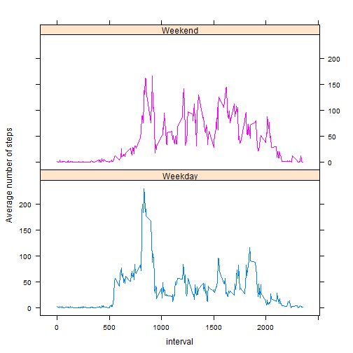

# Reproducible Research: Peer Assessment 1


## Loading and preprocessing the data

In this part we will transform the date column which is processed as a factor into a date format.


```r
temp <- tempfile() # Create a temp file to store the zip
download.file("http://d396qusza40orc.cloudfront.net/repdata%2Fdata%2Factivity.zip",temp)
data <- read.table(unz(temp,"activity.csv"),sep=",",header=TRUE)
unlink(temp)
rm(temp)
data$date <- as.Date(data$date, format="%Y-%m-%d")
```


## What is mean total number of steps taken per day?

We first create a new dataframe with the number of steps taken each day.
The function aggregate will ignore the missing value and thus when there is no value for a given day this day will not be included in this new dataframe.


```r
rawdailydata <- aggregate(steps ~ date, data, sum)
```

We create an histogram using the basic hist function


```r
hist(rawdailydata$steps, breaks=10, xlab="Number of steps per day", main="Number of steps per day")
```

 

We then calculate the mean and the median of the number of steps per day.
And we also use the summary function to the mean, median, quartiles.


```r
mean(rawdailydata$steps)
```

```
## [1] 10766
```

```r
median(rawdailydata$steps)
```

```
## [1] 10765
```

```r
summary(rawdailydata$steps)
```

```
##    Min. 1st Qu.  Median    Mean 3rd Qu.    Max. 
##      41    8840   10800   10800   13300   21200
```

## What is the average daily activity pattern?

To get the daily activity pattern we need to create a new dataset aggregating the steps by interval using the mean function


```r
rawintervaldata <- aggregate(steps ~ interval, data, mean)
```

We then plot the data using the type="l" option.


```r
plot (rawintervaldata, type="l", ylab="Average number of steps", main="Average number of steps per interval")
```

 

We then find the interval with the maximum number of steps :


```r
rawintervaldata[rawintervaldata$steps == max(rawintervaldata[,"steps"]),][,"interval"]
```

```
## [1] 835
```
## Imputing missing values

The number of missing value in the "steps" column is given by :


```r
sum(is.na(data$steps))
```

```
## [1] 2304
```

We first duplicate our initial dataset in a new dataset then to fill the missing values we use the mean value on the given interval.


```r
newData <- data
newData <- merge(newData, rawintervaldata, by = "interval" ) #add a column with the mean of number of steps for this interval
isMissing <-is.na(newData$steps.x) #get the missing values
newData[isMissing,]["steps.x"]<-newData[isMissing,]["steps.y"] #replace the missing values with the mean
newData$steps.y<-NULL # drop the unneeded column.
colnames(newData)[2]<-"steps" #to get the proper name for the steps column.
```

We plot the new data set and get the mean and median for this new data set.

```r
hist(aggregate(steps ~ date, newData, sum)$steps, breaks=10, xlab="Number of steps per day", main="Number of steps per day")
```

 

```r
summary(aggregate(steps ~ date, newData, sum)$steps)
```

```
##    Min. 1st Qu.  Median    Mean 3rd Qu.    Max. 
##      41    9820   10800   10800   12800   21200
```

We notice that the mean and median didn't change. Only the first quarter and second quarter changed. That imply that for a given day either we have all the data or we don't have any data otherwise as we have "added" some steps the median and mean would have increased. The only reason why the median and mean didn't increased is because complete day was missing : the aggregate function simply doesn't create a new row if there is no value for a given day and there is 53 row in the aggregate indicating only 53 days had data instead of the 61 days corresponding to the observed period. 

## Are there differences in activity patterns between weekdays and weekends?

We create a new column in newData named Weekday using the weekdays function. Then we create a new factor column named day with two possible values : "Weekday" and "Weekend"


```r
newData["day"]<-weekdays(newData$date)
newData["Weekday"] <- ifelse(newData$day == "dimanche" | newData$day == "samedi" , "Weekend", "Weekday") #Dimanche and Samedi are Sunday and Saturday in french. Weekdays give me results in french...
newData$Weekday <- as.factor(newData$Weekday)
```

We subset two data frames from newData corresponding to weekends and weekdays aggregating the data by mean by interval and then we plot this two dataframes. 


```r
library(lattice, quietly=TRUE, warn.conflicts = FALSE)
```

```
## Warning: package 'lattice' was built under R version 3.1.1
```

```r
xyplot(steps ~ interval | Weekday, aggregate(steps ~ interval + Weekday, newData, FUN = mean), layout=c(1,2), type ="l",
       group = Weekday, ylab="Average number of steps")
```

 
